# Reto: Servidor Web No Concurrente en Java

Este proyecto es la solución a un reto académico que consiste en implementar un servidor web sencillo en **Java** sin el uso de frameworks externos (como Spark o Spring). El servidor debe:
- Atender múltiples solicitudes de manera secuencial (no concurrente).
- Leer y retornar archivos del disco local, incluyendo páginas HTML, archivos JavaScript, CSS e imágenes.
- Permitir la construcción de una aplicación web de prueba que consuma servicios REST de forma asíncrona desde el frontend.
- Utilizar únicamente Java y las librerías estándar para el manejo de red y archivos.

## Objetivos del reto
- Demostrar el manejo de sockets y protocolos HTTP en Java puro.
- Servir archivos estáticos y recursos web desde el backend.
- Implementar servicios REST simples y consumirlos desde el frontend usando JavaScript asíncrono.

### Puerto que vamos a utilizar
````
Puerto: 8080
````

## Arquitectura

El servidor está implementado en la clase principal `HttpServer.java` y funciona de la siguiente manera:

1. **Escucha en un puerto TCP (35003)** usando `ServerSocket` y acepta conexiones de clientes de forma secuencial (no concurrente).
2. **Procesa cada solicitud HTTP** leyendo la primera línea para identificar el método y la ruta solicitada.
3. **Manejo de archivos estáticos:**
    - Si la ruta corresponde a un archivo existente en `src/main/resources/public`, el servidor lee el archivo del disco y lo retorna con el tipo MIME adecuado (HTML, CSS, JS, imágenes, etc.).
4. **Manejo de servicios REST:**
    - Si la ruta solicitada corresponde a un endpoint especial (por ejemplo, `/hello`, `/hellopost`, `/app/hello`), el servidor ejecuta un método Java que genera la respuesta (texto o JSON), permitiendo la comunicación asíncrona desde el frontend.
5. **Frontend de prueba:**
    - La carpeta `public` contiene una aplicación web con HTML, CSS, JS e imágenes que permite probar tanto la carga de archivos estáticos como la invocación de servicios REST mediante AJAX/fetch.

El servidor no utiliza ningún framework web externo, solo clases estándar de Java (`ServerSocket`, `Files`, `PrintWriter`, etc.).

---

# Servidor web no concurrente
Este proyecto implementa un servidor web sencillo en **Java** que permite:
- Servir archivos estáticos como HTML, CSS, JS e imágenes.  
- Manejar solicitudes HTTP con los métodos **GET** y **POST**.  
- Responder a formularios desde el navegador. 

## Para comenzar
Estas instrucciones te permitirán obtener una copia del proyecto y ejecutarlo en tu máquina local para desarrollo y pruebas.  


### Estructura del proyecto

La estructura de directorios del proyecto es la siguiente:


```
.
└── src
    ├── main
    │   ├── java
    │   │   └── com
    │   │       └── arep
    │   │           └── taller1
    │   │               └── talle1arep
    │   │                   └── HttpServer.java
    │   └── resources
    │       └── public
    │           └── index.html
    └── pom.xml
```

### Prerequisites
Debes tener instalado en tu equipo:  

- [Java 17 o superior](https://adoptium.net/)  
- [Apache Maven](https://maven.apache.org/) 

Verifica las versiones:
- $ java -version
- $ mvn -version


### Instalación
Clona este repositorio en tu máquina:
```
git clone https://github.com/Ttowers-09/Lab_MicroframeworksWEB_AREP_IvanTorres.git
```
Accedemos a la carpeta:
```
cd Lab_MicroframeworksWEB_AREP_IvanTorres
```

## Ejecución (Solo consola)

Estando dentro de la carpeta Lab_MicroframeworksWEB_AREP_IvanTorres ejecutamos el siguiente  comando:
```
java -cp target/classes com.arep.taller1.talle1arep.HttpServer
```


la consola se quedará esperando respuesta asi que nos dirigimos a nuestro browser y escribimos:
```
http://localhost:8080
```

## Ejecución (Con Maven)
Estando dentro de la carpeta Arep_Taller1_IvanTorres ejecutamos el siguiente  comando:
```
mvn clean install
```
Con esto aseguramos que la compilación se realice desde cero eliminando cualquier archivo de compilación anterior.
luego utilizamos:
```
mvn compile
```
Para ejecutar el código fuente del proyecto.
luego utilizamos:
```
mvn exec:java
```
Para ejecutar la clase principal con método main, se verá de la siguiente manera.
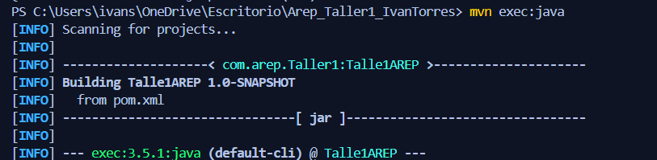


### Finalizar la ejecución

En la consola ejecutamos la combinación de teclas: 

```
Windows: Ctrl + C
Mac: Comando + C
```
## Prueba de funcionalidades:
-Cuando carga en el buscador se verá de la siguiente manera:
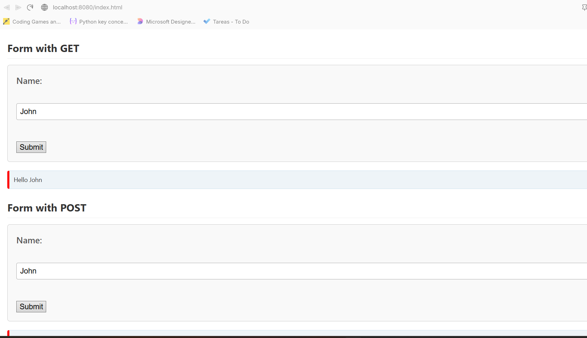

- Luego ejecutamos lo siguiente en nuestro buscador, deberiamos de ver la salida "Hello + {nombre}"
```
http://localhost:8080/App/hello?name=nombre
```
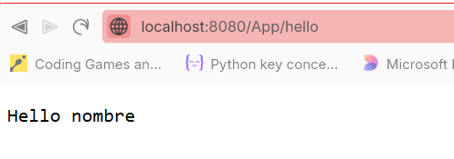

- Al ejecutar el siguiente valor deberiamos de ver el valor numérico del valor de PI
```
http://localhost:8080/App/pi
```
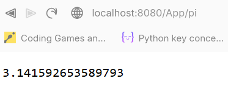

- Para visualizar los archivos estáticos, los cuales estan en la carpeta resources:
```
http://localhost:8080/index.html
```
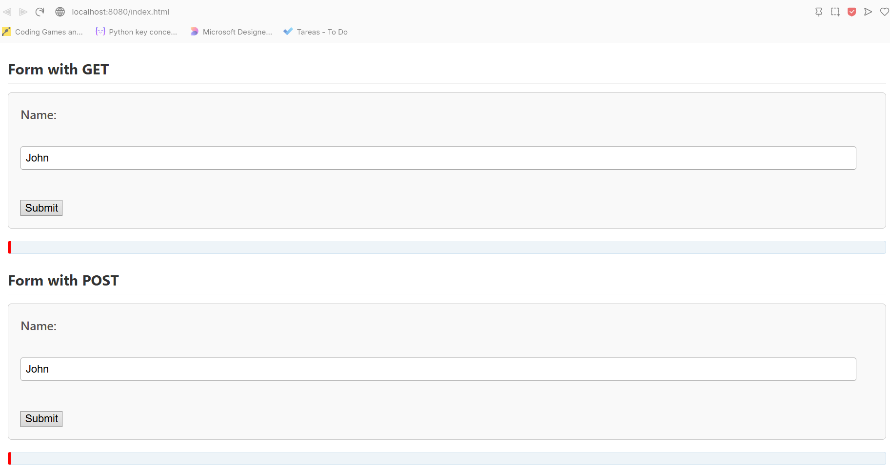
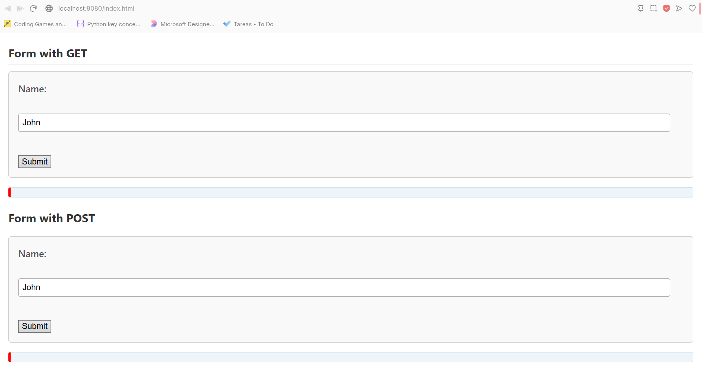
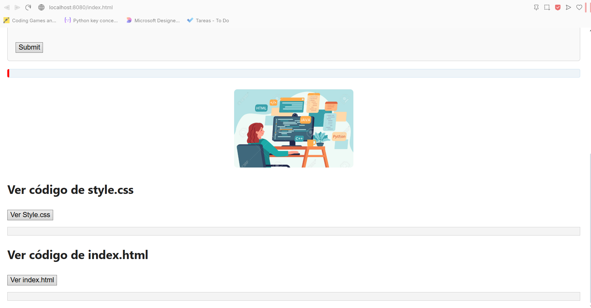

- Para ejecutar el método GET podemos utilizar el cuadro para poder colocar cualquier nombre:
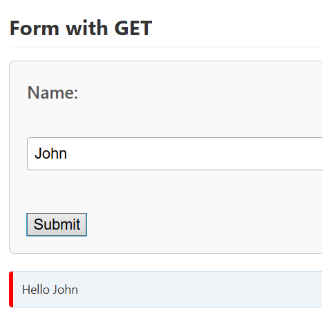
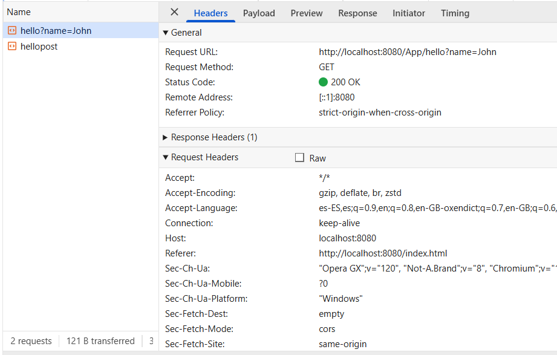

- Para ejecutar el método POST podemos utilizar el cuadro para poder colocar cualquier nombre:
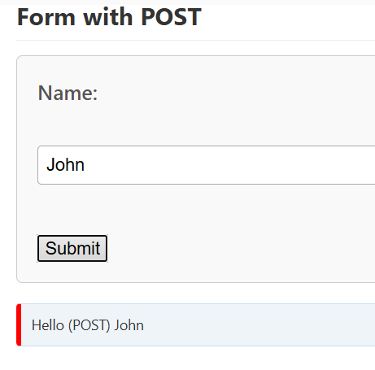
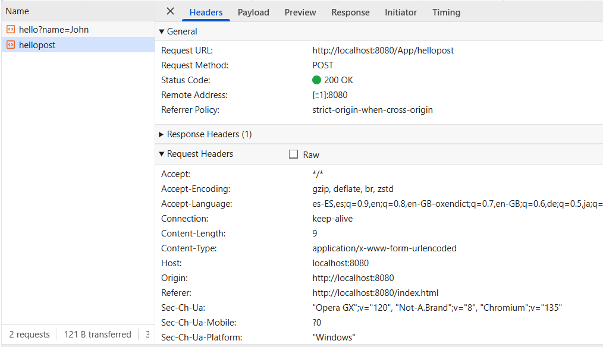

- Podemos visualizar los archivos estaticos definiendolos en nuestras URL, de la siguiente manera:
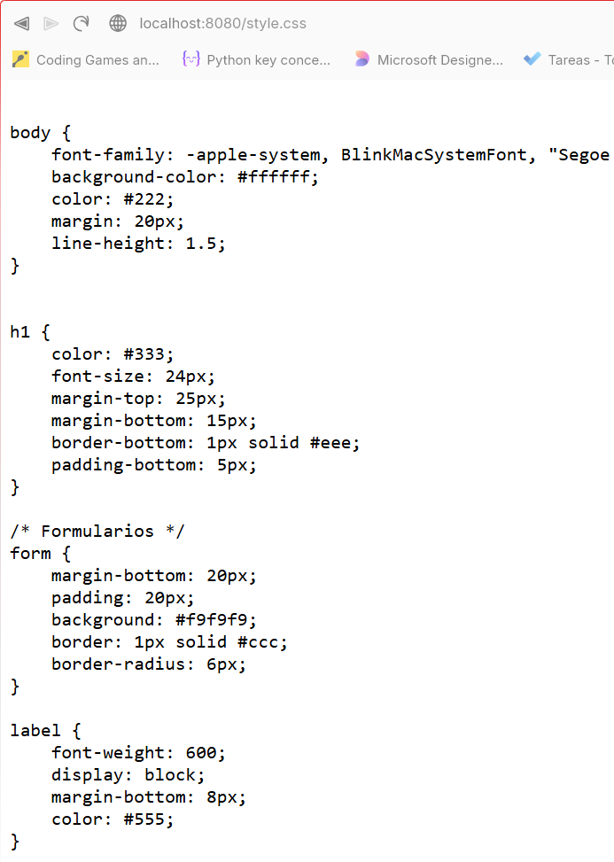

además de eso, en el index podemos encontar botones para ver los archivos:


## Ejecutar los Test:
- Los test se encuentran en la carpeta: ../test/java/com/arep/taller1/talle1.arep

- Para ejecutar los test utilizamos el siguiente comando:
```
mvn test
```
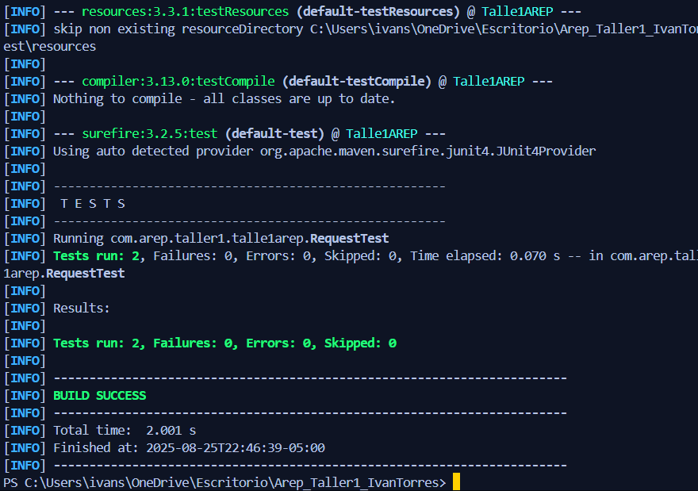

## Construido con:

- **Java Standard Library** - El proyecto está construido con clases de I/O y java.net de la librería estándar de Java.

- **Maven** - Se utiliza como herramienta de gestión de dependencias y compilación.

## Contribuir

En caso de querer contribuir envia una pull request especificando los cambios, en que afecta el código, el comportamiento del proyecto y su beneficio.

## Versionamiento

Usamos Git y GitHub para realizar el versionamiento del proyecto.

## Authors

* **Ivan Santiago Forero Torres** - *Trabajo inicial* - gitHub User: [Ttowers-09]


## Licencia

This project is licensed under the MIT License - see the [LICENSE.md](LICENSE.md) file for details

